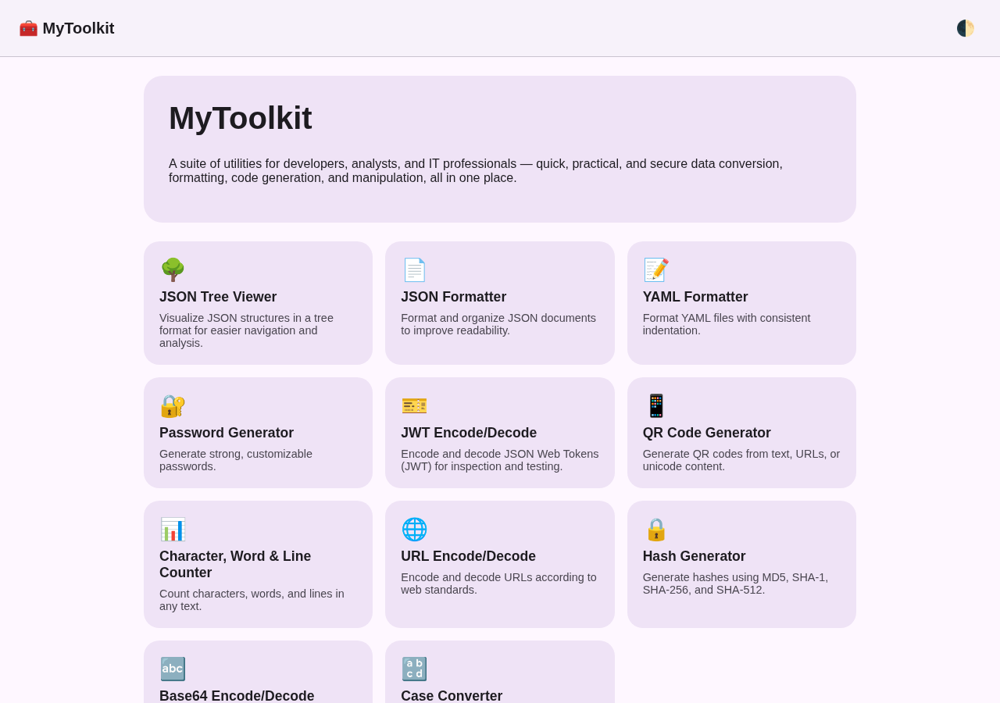
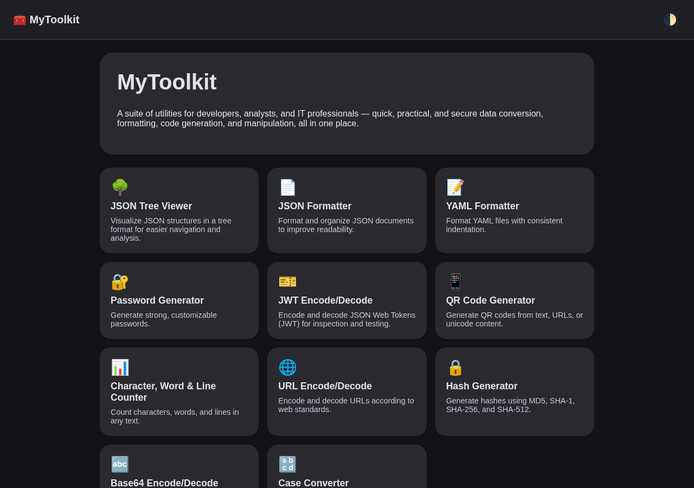
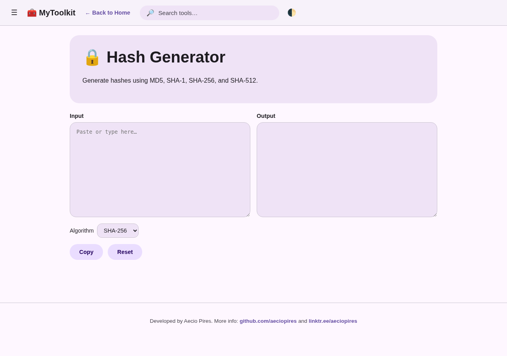
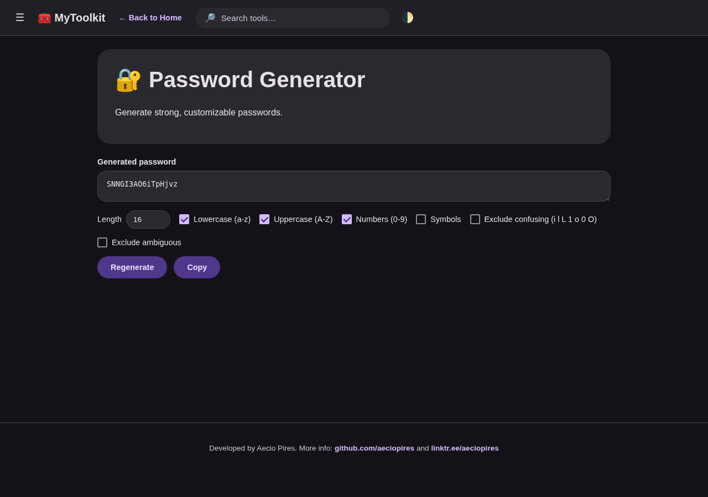
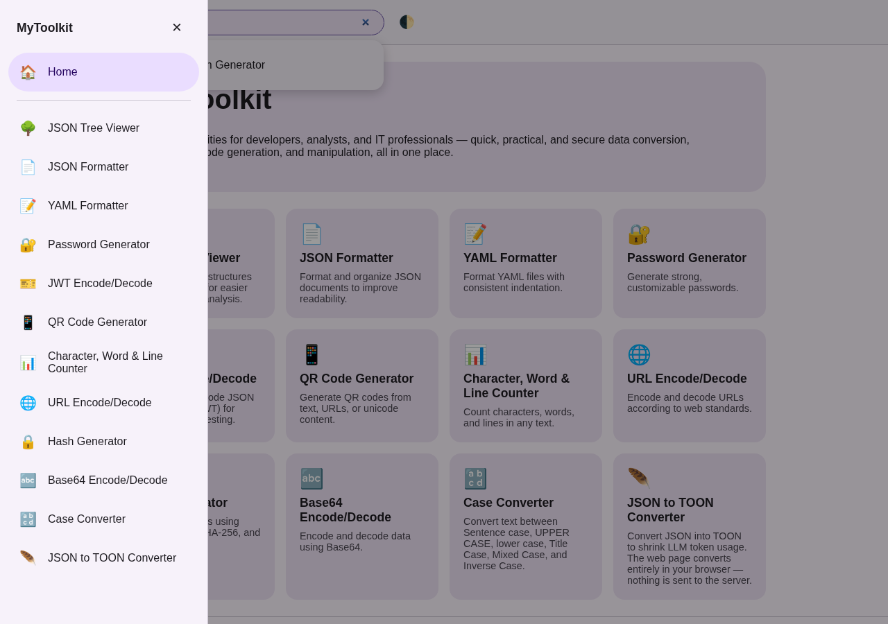
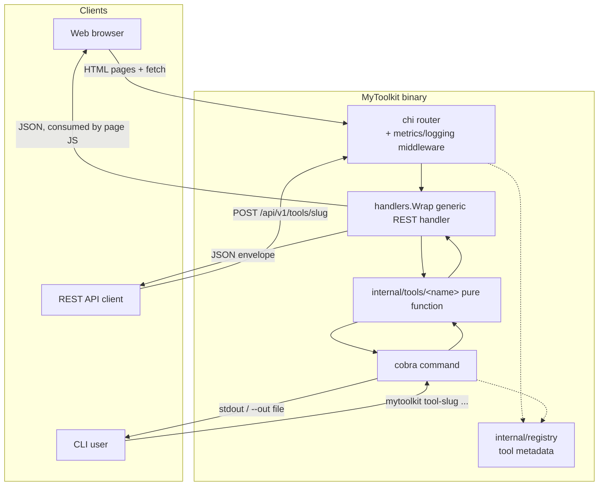
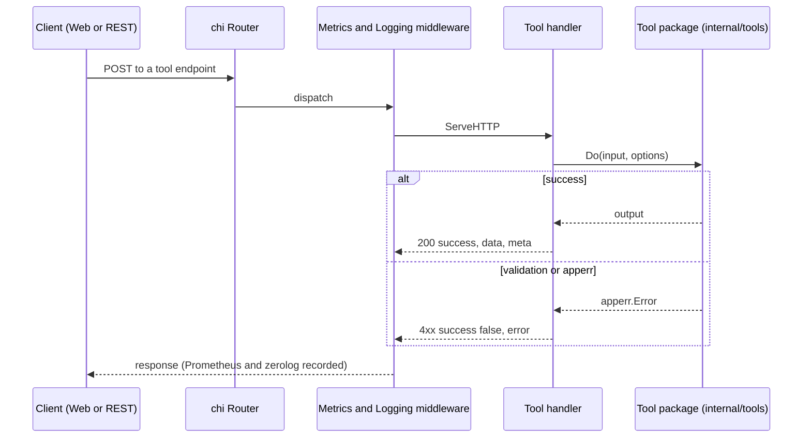

<!-- TOC -->

- [MyToolkit](#mytoolkit)
  - [Screenshots](#screenshots)
  - [Features](#features)
  - [Software Requirements](#software-requirements)
  - [Getting started](#getting-started)
    - [Makefile targets](#makefile-targets)
    - [Web mode](#web-mode)
    - [CLI mode](#cli-mode)
    - [Docker](#docker)
    - [Kubernetes / Helm](#kubernetes--helm)
  - [Observability (Prometheus + Grafana)](#observability-prometheus--grafana)
  - [Documentation](#documentation)
  - [API Documentation (Swagger)](#api-documentation-swagger)
  - [Environment variables](#environment-variables)
  - [Testing](#testing)
  - [Tools sites related](#tools-sites-related)
  - [Technology Stack](#technology-stack)
  - [Architecture](#architecture)
  - [Directory structure](#directory-structure)
  - [Developer](#developer)
  - [License](#license)

<!-- TOC -->

# MyToolkit

**MyToolkit** is a suite of utilities designed to simplify common daily tasks for developers, analysts, and IT professionals. By bringing various tools together in one place, it enables quick, practical, and secure data conversion, formatting, code generation, and manipulation, eliminating the need to switch between multiple websites and applications.

It ships as a single Go binary that runs as a **web application** (REST API + server-rendered UI) by default, or as a **CLI** for any individual tool.

## Screenshots

Images live in [`images/`](images/).

| Homepage (light) | Homepage (dark) |
|---|---|
|  |  |

| Hash Generator (light) | Password Generator (dark) |
|---|---|
|  |  |

| Navigation drawer + search |
|---|
|  |

Append `?theme=light` or `?theme=dark` to any page URL to force a theme (useful for screenshots/demos); otherwise the toggle in the top-right corner persists your choice in `localStorage`.

Every page shares the same navigation shell:
- **☰ hamburger menu** — opens/collapses a navigation drawer listing every tool (with a scrim behind it; click the scrim, the ✕, or press Escape to close).
- **🔎 search bar** — filters tools client-side, live, as you type, matching against each tool's name and description (the same text shown on its homepage card and tool-page hero card); click a result or press Enter to jump to it.
- **← Back to Home** — shown on every tool page, next to the brand.
- **Footer** — on every page, with developer/contact links.

## Features

- 🌳 **JSON Tree Viewer** – Visualize JSON structures in a tree format for easier navigation and analysis.
- 📄 **JSON Formatter** – Format and organize JSON documents to improve readability.
- 📝 **YAML Formatter** – Format YAML files with consistent indentation.
- 🔐 **Password Generator** – Generate strong, customizable passwords, with confusing/ambiguous character exclusion.
- 🎫 **JWT Encode/Decode** – Encode and decode JSON Web Tokens (JWT) for inspection and testing.
- 📱 **QR Code Generator** – Generate QR codes from text, URLs, or unicode content.
- 📊 **Character, Word & Line Counter** – Count characters, words, and lines in any text.
- 🌐 **URL Encode/Decode** – Encode and decode URLs according to web standards.
- 🔒 **Hash Generator** – Generate hashes using **MD5**, **SHA-1**, **SHA-256**, and **SHA-512**.
- 🔤 **Base64 Encode/Decode** – Encode and decode data using Base64.
- 🔡 **Case Converter** – Convert text between **Sentence case**, **UPPER CASE**, **lower case**, **Title Case**, **MiXeD CaSe**, and **iNvErSe cAsE**.
- 🪶 **JSON to TOON Converter** – Convert JSON into [TOON](https://github.com/toon-format/spec) to shrink LLM token usage. The web page converts **entirely in your browser** — no data is sent to the server for the interactive tool (REST/CLI remain available for scripted use).
- 🔃 **YAML to JSON Converter** – Convert a YAML document to pretty-printed JSON, powered by [sigs.k8s.io/yaml](https://github.com/kubernetes-sigs/yaml).
- 🔄 **JSON to YAML Converter** – Convert a JSON document to YAML, powered by [sigs.k8s.io/yaml](https://github.com/kubernetes-sigs/yaml).
- ☸️ **Kubernetes YAML Validator** – Validate that a YAML document (single or multi-document) has the fields the Kubernetes API requires (`apiVersion`, `kind`, and a well-formed `metadata` block), powered by [sigs.k8s.io/yaml](https://github.com/kubernetes-sigs/yaml). Does not validate against a specific resource's full schema — see the docs.

## Software Requirements

`make check-tools` verifies all of these are installed and on `PATH`:

| Tool | Purpose |
|---|---|
| [Go](https://go.dev/dl/) >= 1.25 | Build, run, and test the application (`app/go.mod` pins `go 1.25.0`). |
| [Git](https://git-scm.com/) | Clone the repository and version control. |
| [Docker](https://docs.docker.com/get-docker/) (with the Compose plugin, `docker compose`) | Build/run container images and the local Prometheus + Grafana stack. |
| [Helm](https://helm.sh/) v3 | Lint, template, and install the Kubernetes chart in [`helm/mytoolkit`](helm/mytoolkit). |
| [kubectl](https://kubernetes.io/docs/tasks/tools/) | Interact with a Kubernetes cluster. |
| [kind](https://kind.sigs.k8s.io/) | Run a local Kubernetes cluster (`kind-multinodes`) for `make kind-load`/`helm-install`/`helm-test`. |
| [golangci-lint](https://golangci-lint.run/) | Run `make lint`. |
| [helm-docs](https://github.com/norwoodj/helm-docs) | Regenerate `helm/mytoolkit/README.md` via `make helm-docs`. |

Only Go, Git, and Docker are needed to build/run the app or its container image; Helm/kubectl/kind/golangci-lint/helm-docs are needed for the Kubernetes and linting workflows.

## Getting started

### Makefile targets

Run `make help` for the full, self-documenting list. Most targets `cd` into `app/` for you:

| Target | Description |
|---|---|
| `help` | Show the help listing (default goal). |
| `build` | Build the mytoolkit binary into `bin/` (version from `./VERSION`). |
| `run` | Run the web server locally (`go run`). |
| `test` | Run unit tests. |
| `test-verbose` | Run unit tests with verbose output. |
| `coverage` | Run tests with a coverage report. |
| `lint` | Run `golangci-lint`. |
| `fmt` | Format Go source (`gofmt -s -w`). |
| `vet` | Run `go vet`. |
| `check-tools` | Verify required development/runtime tools are installed. |
| `deps-check` | Verify the Go module graph is tidy (`go.mod`/`go.sum` hygiene). |
| `docker-build` | Build a local single-platform Docker image (version from `./VERSION`). |
| `docker-buildx` | Build (and validate) a multi-arch image for `linux/amd64` + `linux/arm64`. |
| `docker-run` | Run the local Docker image on port 8080. |
| `docker-push` | Prompt for Docker Hub credentials and push a multi-arch (amd64+arm64) image tagged with `$(VERSION)`. |
| `compose-up` | Start the app via `docker compose`. |
| `compose-down` | Stop the app started via `docker compose`. |
| `helm-lint` | Lint the Helm chart. |
| `helm-template` | Render the Helm chart locally. |
| `helm-set-appversion` | Sync `helm/mytoolkit/Chart.yaml`'s `appVersion` with the root `VERSION` file. |
| `helm-docs` | Sync `appVersion` with `VERSION` (runs `helm-set-appversion` first), then regenerate `helm/mytoolkit/README.md` from `README.md.gotmpl` + `values.yaml` comments. |
| `kind-load` | Load the local Docker image into the `kind-multinodes` cluster. |
| `helm-install` | `helm upgrade --install` against the kind cluster/namespace. |
| `helm-uninstall` | `helm uninstall` from the kind cluster/namespace. |
| `helm-test` | Run `helm test` (hits `/healthz`) against the installed release. |
| `swagger-gen` | Regenerate `app/docs` (Swagger/OpenAPI spec) from `@`-annotations — run after touching any `@Router`/`@Summary`/etc. comment. |
| `clean` | Remove build artifacts. |

`make helm-docs` always runs `helm-set-appversion` first, syncing `helm/mytoolkit/Chart.yaml`'s `appVersion` field to the repo-root `VERSION` file before regenerating the chart README — so the chart's declared app version can never silently drift from what `mytoolkit --version` reports.

### Web mode

Web mode is the default — running the binary with no arguments starts the server:

```
make run
# or
cd app && go run ./cmd/mytoolkit serve --port 8080
```

Then open http://localhost:8080.

### CLI mode

Any tool can be run directly from the command line — see [Documentation](#documentation) for the full flag reference per tool:

```
$ echo -n 'hello' | mytoolkit hash-gen --algo sha256
2cf24dba5fb0a30e26e83b2ac5b9e29e1b161e5c1fa7425e73043362938b9824

$ mytoolkit --help
$ mytoolkit <tool-slug> --help
$ mytoolkit --version   # or -v
mytoolkit version 1.0.0
```

The version comes from the repo-root [`VERSION`](VERSION) file — the single source of truth read by both `make build` (embedded into the Go binary via `-ldflags -X`) and `make docker-build`/`docker-buildx`/`docker-push` (passed as a `VERSION` build arg and used as the image tag), so the CLI's `--version` output and the Docker image tag always agree.

### Docker

```
make docker-build   # local, single-platform image (host arch), for docker-run
make docker-buildx  # validate a multi-arch build (linux/amd64 + linux/arm64) via docker buildx
make docker-run     # run the local image on :8080
# or
docker compose up --build
```

To publish to Docker Hub, run `make docker-push` — it interactively prompts for your Docker Hub username, password/access token (hidden input, piped straight into `docker login --password-stdin`, never printed or stored), and target repository, then builds and pushes a multi-arch (`linux/amd64` + `linux/arm64`) image and logs out. A Docker Hub [access token](https://docs.docker.com/security/for-developers/access-tokens/) is recommended over your account password.

### Kubernetes / Helm

```
make helm-lint
make kind-load             # load the image into the kind-kind-multinodes cluster
make helm-install           # helm upgrade --install against that cluster
make helm-test               # helm test (hits /healthz)
```

See [helm/mytoolkit](helm/mytoolkit) for chart details (probes, Prometheus scrape annotations, autoscaling/ingress toggles).

## Observability (Prometheus + Grafana)

`docker compose up --build` also starts Prometheus (scraping `mytoolkit`'s `/metrics` every 15s, per [`observability/prometheus.yml`](observability/prometheus.yml)) and Grafana, pre-provisioned with a Prometheus data source and the **MyToolkit — Application Metrics** dashboard ([`observability/mytoolkit-dashboard.json`](observability/mytoolkit-dashboard.json)) — no manual setup needed.

- Prometheus: <http://localhost:9090>
- Grafana: <http://localhost:3000> (login `admin` / `admin`, per `GF_SECURITY_ADMIN_PASSWORD` in `docker-compose.yml`; Grafana will prompt to change it on first login — safe to skip for local use)

The dashboard covers every metric the app exposes: HTTP request rate/error-rate by tool and status, request latency percentiles (overall and per-tool), successful-invocation counts per tool (the same data behind `GET /api/v1/metrics/ranking`), and Go runtime/process health (goroutines, memory, GC pauses, open file descriptors, CPU, network I/O). See `.skills/observability/SKILL.md` for the provisioning layout and how to add a panel for a new metric.

**Note on editing the dashboard while the stack is running**: `observability/mytoolkit-dashboard.json` is bind-mounted as a single file, which some editors/tools replace via write-new-file-then-rename — Docker's bind mount then keeps referencing the old file. If your edits don't show up after Grafana's `updateIntervalSeconds` (30s) or a manual `POST /api/admin/provisioning/dashboards/reload`, run `docker compose restart grafana`.

## Documentation

| Feature | API reference | CLI reference | Testing reference |
|---|---|---|---|
| JSON Tree Viewer | [docs/api/json-tree.md](docs/api/json-tree.md) | [docs/cli/json-tree.md](docs/cli/json-tree.md) | [docs/testing/json-tree.md](docs/testing/json-tree.md) |
| JSON Formatter | [docs/api/json-format.md](docs/api/json-format.md) | [docs/cli/json-format.md](docs/cli/json-format.md) | [docs/testing/json-format.md](docs/testing/json-format.md) |
| YAML Formatter | [docs/api/yaml-format.md](docs/api/yaml-format.md) | [docs/cli/yaml-format.md](docs/cli/yaml-format.md) | [docs/testing/yaml-format.md](docs/testing/yaml-format.md) |
| Password Generator | [docs/api/password-gen.md](docs/api/password-gen.md) | [docs/cli/password-gen.md](docs/cli/password-gen.md) | [docs/testing/password-gen.md](docs/testing/password-gen.md) |
| JWT Encode/Decode | [docs/api/jwt.md](docs/api/jwt.md) | [docs/cli/jwt.md](docs/cli/jwt.md) | [docs/testing/jwt.md](docs/testing/jwt.md) |
| QR Code Generator | [docs/api/qrcode.md](docs/api/qrcode.md) | [docs/cli/qrcode.md](docs/cli/qrcode.md) | [docs/testing/qrcode.md](docs/testing/qrcode.md) |
| Character, Word & Line Counter | [docs/api/text-count.md](docs/api/text-count.md) | [docs/cli/text-count.md](docs/cli/text-count.md) | [docs/testing/text-count.md](docs/testing/text-count.md) |
| URL Encode/Decode | [docs/api/url-encode.md](docs/api/url-encode.md) | [docs/cli/url-encode.md](docs/cli/url-encode.md) | [docs/testing/url-encode.md](docs/testing/url-encode.md) |
| Hash Generator | [docs/api/hash-gen.md](docs/api/hash-gen.md) | [docs/cli/hash-gen.md](docs/cli/hash-gen.md) | [docs/testing/hash-gen.md](docs/testing/hash-gen.md) |
| Base64 Encode/Decode | [docs/api/base64.md](docs/api/base64.md) | [docs/cli/base64.md](docs/cli/base64.md) | [docs/testing/base64.md](docs/testing/base64.md) |
| Case Converter | [docs/api/case-convert.md](docs/api/case-convert.md) | [docs/cli/case-convert.md](docs/cli/case-convert.md) | [docs/testing/case-convert.md](docs/testing/case-convert.md) |
| JSON to TOON Converter | [docs/api/json-toon.md](docs/api/json-toon.md) | [docs/cli/json-toon.md](docs/cli/json-toon.md) | [docs/testing/json-toon.md](docs/testing/json-toon.md) |
| YAML to JSON Converter | [docs/api/yaml-to-json.md](docs/api/yaml-to-json.md) | [docs/cli/yaml-to-json.md](docs/cli/yaml-to-json.md) | [docs/testing/yaml-to-json.md](docs/testing/yaml-to-json.md) |
| JSON to YAML Converter | [docs/api/json-to-yaml.md](docs/api/json-to-yaml.md) | [docs/cli/json-to-yaml.md](docs/cli/json-to-yaml.md) | [docs/testing/json-to-yaml.md](docs/testing/json-to-yaml.md) |
| Kubernetes YAML Validator | [docs/api/k8s-validate.md](docs/api/k8s-validate.md) | [docs/cli/k8s-validate.md](docs/cli/k8s-validate.md) | [docs/testing/k8s-validate.md](docs/testing/k8s-validate.md) |

See also: [Environment variables](docs/environment-variables.md), and one `.skills/<tool>/SKILL.md` per tool for implementation notes.

## API Documentation (Swagger)

Every REST endpoint is also documented interactively at **`/swagger/index.html`** (e.g. <http://localhost:8080/swagger/index.html> when running locally) — generated from code annotations via [swaggo/swag](https://github.com/swaggo/swag), covering all 15 `/api/v1/tools/<slug>` endpoints plus `GET /api/v1/tools`, `GET /api/v1/metrics/ranking`, `/healthz`, and `/readyz`. Each endpoint's page includes a live "Try it out" button that sends a real request to the running server. The raw spec is at `/swagger/doc.json`.

If you change a tool's REST request/response shape, update its `@`-annotations (see `.skills/swagger/SKILL.md`) and run `make swagger-gen` to regenerate `app/docs/` before committing.

## Environment variables

| Variable | CLI flag (`serve`) | Default | Description |
|---|---|---|---|
| `MYTOOLKIT_HOST` | `--host` | `0.0.0.0` | Interface the HTTP server binds to. |
| `MYTOOLKIT_PORT` | `--port` | `8080` | TCP port the HTTP server listens on. |
| `MYTOOLKIT_LOG_LEVEL` | `--log-level` | `info` | zerolog level: `debug`, `info`, `warn`, `error`. |

Full details: [docs/environment-variables.md](docs/environment-variables.md). Copy `.env-example` to `.env` for local dev / `docker-compose`.

## Testing

```
cd app
go test ./...
go test ./... -coverprofile=coverage.out && go tool cover -func=coverage.out
```

Or via Makefile: `make test`, `make coverage`.

Every example in `docs/api/<tool>.md` and `docs/cli/<tool>.md` is verified against the running binary, not hand-typed — if you change a tool's behavior, re-run its documented commands/requests and update the docs to match the real output before committing.

## Tools sites related

- [All Online Tools in “One Box”](https://10015.io/tools/case-converter)
- [JSON Web Token (JWT) Debugger](https://www.jwt.io/)
- [JSON to TOON Converter](https://scalevise.com/json-toon-converter)
- [Base64 Decode](https://www.base64decode.org)
- [JSON Formatter](https://jsonformatter.curiousconcept.com/)
- [YAML Formatter](https://jsonformatter.org/yaml-formatter)
- [URL Encode/Decode](https://www.urlencoder.org)
- [JSON Tree Viewer](https://jsonifypro.com/json-viewer.html)
- [JSON Path Tester](https://jsonifypro.com/json-path-tester.html)
- [CSV to JSON Converter](https://jsonifypro.com/csv-to-json-converter.html)
- [JSONifyPro](https://jsonifypro.com/index.html)
- [AlphaDevTools](https://alphadevtools.com/)
- [JSON Formatters Pro](https://jsonformatterspro.com/json-to-yaml/)
- [DevOps Projects HQ](https://devopsprojectshq.com/tools/)
- [IAM Policy JSON to Terraform](https://flosell.github.io/iam-policy-json-to-terraform/)
- [GitHub - flosell/iam-policy-json-to-terraform](https://github.com/flosell/iam-policy-json-to-terraform/)
- [GitHub - almeida-matheus/policy-converter-aws-to-terraform](https://github.com/almeida-matheus/policy-converter-aws-to-terraform)
- [IAM CloudCopilot](https://iam.cloudcopilot.io/tools/iam-convert)
- [GitHub - cloud-copilot/iam-convert](https://github.com/cloud-copilot/iam-convert)
- [Tiktokenizer-Vercel](https://tiktokenizer.vercel.app)
- [GitHub - dqbd/tiktokenizer](https://github.com/dqbd/tiktokenizer)
- [JSON.org](https://www.json.org/json-en.html)
- [YAML.org](https://yaml.org/)
- [W3Schools - Tools](https://www.w3schools.com/tools)
- [jsonlint - tools](https://jsonlint.com/tools)
- [Material Design 3](https://m3.material.io/)
- [Golang JWT](https://golang-jwt.github.io/jwt/)
- [GitHub - golang-jwt/jwt](https://github.com/golang-jwt/jwt)
- [Toon Format](https://toonformat.dev/)
- [GitHub - toon-format/toon](https://github.com/toon-format/toon)
- [Crontab.guru](https://crontab.guru/)

## Technology Stack

| Layer | Technology |
|---|---|
| Language & runtime | [Go](https://go.dev/) 1.25 |
| HTTP router | [go-chi/chi](https://github.com/go-chi/chi) v5 |
| CLI framework | [spf13/cobra](https://github.com/spf13/cobra) + [spf13/pflag](https://github.com/spf13/pflag) |
| Structured logging | [rs/zerolog](https://github.com/rs/zerolog) (JSON to stderr) |
| Metrics | [prometheus/client_golang](https://github.com/prometheus/client_golang) |
| API documentation | [swaggo/swag](https://github.com/swaggo/swag) + [swaggo/http-swagger](https://github.com/swaggo/http-swagger) (OpenAPI/Swagger UI, generated from code annotations) |
| JWT tool | [golang-jwt/jwt](https://github.com/golang-jwt/jwt) v5 |
| QR Code tool | [skip2/go-qrcode](https://github.com/skip2/go-qrcode) |
| YAML processing | [gopkg.in/yaml.v3](https://github.com/go-yaml/yaml) and [sigs.k8s.io/yaml](https://github.com/kubernetes-sigs/yaml) |
| Web frontend | Server-rendered Go `html/template`, embedded vanilla CSS/JS, [Material Design 3](https://m3.material.io/) design tokens |
| Containerization | Docker multi-stage build onto [`gcr.io/distroless/static-debian12:nonroot`](https://github.com/GoogleContainerTools/distroless), Docker Compose |
| Orchestration | Kubernetes, [Helm](https://helm.sh/) chart ([`helm/mytoolkit`](helm/mytoolkit)) |
| Observability stack | [Prometheus](https://prometheus.io/) + [Grafana](https://grafana.com/) (provisioned via `docker-compose.yml`, see [Observability](#observability-prometheus--grafana)) |

## Architecture

Every tool's business logic lives in one pure Go package (`app/internal/tools/<name>`), reused by all three surfaces — the REST handler, the CLI subcommand, and (via `fetch()`) the web UI:



Request lifecycle for a single tool call (REST or web — the web UI is itself a REST client):



Each feature's own request/response examples and a per-feature Mermaid note live in its `docs/api/<slug>.md` file — see [Documentation](#documentation).

Shared cross-cutting packages (see `CLAUDE.md` and `PLANS/PLAN_ARCHITECTURE.md` for the full rationale): `apperr` (error codes), `textio` (CLI `--in`/`--out`), `config` (flag/env/default resolution), `response` (JSON envelope), `registry` (tool metadata).

## Directory structure

```
mytoolkit/
├── app/                    Go module root — all Go/HTML/CSS/JS source
│   ├── cmd/mytoolkit/       entrypoint
│   ├── internal/
│   │   ├── apperr/          shared error type
│   │   ├── textio/          shared --in/--out helpers
│   │   ├── config/          flag > env > default resolution
│   │   ├── response/        shared JSON envelope
│   │   ├── registry/        tool metadata
│   │   ├── cli/              cobra commands (one file per tool)
│   │   ├── httpapi/          chi router, health, generic REST handler
│   │   ├── metrics/          Prometheus collectors + usage ranking
│   │   ├── web/               html/template pages + embedded CSS/JS
│   │   └── tools/<name>/      pure business logic + tests, one package per tool
│   ├── go.mod / go.sum
├── docs/
│   ├── api/<tool>.md        REST reference per tool
│   ├── cli/<tool>.md        CLI reference per tool
│   ├── testing/<tool>.md    Unit test reference per tool
│   └── environment-variables.md
├── .skills/<tool>/SKILL.md  dev skill per tool
├── helm/mytoolkit/          Helm chart
├── images/                  README screenshots
├── observability/           Prometheus scrape config + Grafana dashboard/provisioning
├── PLANS/                   design docs (architecture + one per feature)
├── Dockerfile
├── docker-compose.yml
├── Makefile
├── .env-example
├── README.md / CHANGELOG.md / CONTRIBUTING.md / CLAUDE.md / ROADMAP.md / LICENSE
```

## Developer

Aecio dos Santos Pires
- Linkedin: https://www.linkedin.com/in/aeciopires/
- Site: http://aeciopires.com/

## License

GNU General Public License v3.0
