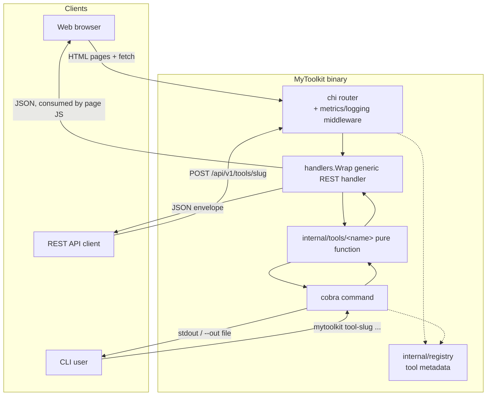

<!-- TOC -->

- [MyToolkit](#mytoolkit)
  - [Screenshots](#screenshots)
  - [Features](#features)
  - [Architecture](#architecture)
  - [Directory structure](#directory-structure)
  - [Getting started](#getting-started)
    - [Web mode](#web-mode)
    - [CLI mode](#cli-mode)
  - [Documentation](#documentation)
  - [Environment variables](#environment-variables)
  - [Testing](#testing)
  - [Docker](#docker)
  - [Kubernetes / Helm](#kubernetes--helm)
  - [Makefile targets](#makefile-targets)
  - [Developer](#developer)
  - [License](#license)

<!-- TOC -->

# MyToolkit

**MyToolkit** is a suite of utilities designed to simplify common daily tasks for developers, analysts, and IT professionals. By bringing various tools together in one place, it enables quick, practical, and secure data conversion, formatting, code generation, and manipulation, eliminating the need to switch between multiple websites and applications.

It ships as a single Go binary that runs as a **web application** (REST API + server-rendered UI) by default, or as a **CLI** for any individual tool.

Sites related:

- [All Online Tools in “One Box”](https://10015.io/tools/case-converter)
- [JSON Web Token (JWT) Debugger](https://www.jwt.io/)
- [JSON to TOON Converter](https://scalevise.com/json-toon-converter)
- [Base64 Decode](https://www.base64decode.org)
- [JSON Formatter](https://jsonformatter.curiousconcept.com/)
- [YAML Formatter](https://jsonformatter.org/yaml-formatter)
- [URL Encode/Decode](https://www.urlencoder.org)

## Screenshots

Images live in [`images/`](images/).

| Homepage (light) | Homepage (dark) |
|---|---|
|  |  |

| Hash Generator (light) | Password Generator (dark) |
|---|---|
|  |  |

Append `?theme=light` or `?theme=dark` to any page URL to force a theme (useful for screenshots/demos); otherwise the toggle in the top-right corner persists your choice in `localStorage`.

## Features

- 🌳 **JSON Tree Viewer** – Visualize JSON structures in a tree format for easier navigation and analysis.
- 📄 **JSON Formatter** – Format and organize JSON documents to improve readability.
- 📝 **YAML Formatter** – Format YAML files with consistent indentation.
- 🔐 **Password Generator** – Generate strong, customizable passwords, with confusing/ambiguous character exclusion.
- 🎫 **JWT Encode/Decode** – Encode and decode JSON Web Tokens (JWT) for inspection and testing.
- 📱 **QR Code Generator** – Generate QR codes from text, URLs, or unicode content.
- 📊 **Character, Word & Line Counter** – Count characters, words, and lines in any text.
- 🌐 **URL Encode/Decode** – Encode and decode URLs according to web standards.
- 🔒 **Hash Generator** – Generate hashes using **MD5**, **SHA-1**, **SHA-256**, and **SHA-512**.
- 🔤 **Base64 Encode/Decode** – Encode and decode data using Base64.
- 🔡 **Case Converter** – Convert text between **Sentence case**, **UPPER CASE**, **lower case**, **Title Case**, **MiXeD CaSe**, and **iNvErSe cAsE**.
- 🪶 **JSON to TOON Converter** – Convert JSON into [TOON](https://github.com/toon-format/spec) to shrink LLM token usage. The web page converts **entirely in your browser** — no data is sent to the server for the interactive tool (REST/CLI remain available for scripted use).

## Architecture

Every tool's business logic lives in one pure Go package (`src/internal/tools/<name>`), reused by all three surfaces — the REST handler, the CLI subcommand, and (via `fetch()`) the web UI:



Request lifecycle for a single tool call (REST or web — the web UI is itself a REST client):

```mermaid
sequenceDiagram
    participant C as Client (Web/REST)
    participant R as chi Router
    participant MW as Metrics + Logging middleware
    participant H as Tool handler
    participant T as internal/tools/&lt;name&gt;

    C->>R: POST /api/v1/tools/&lt;slug&gt;
    R->>MW: dispatch
    MW->>H: ServeHTTP
    H->>T: Do(input, options)
    alt success
        T-->>H: output
        H-->>MW: 200 {success, data, meta}
    else validation/apperr
        T-->>H: *apperr.Error
        H-->>MW: 4xx {success:false, error}
    end
    MW-->>C: response (+ Prometheus/zerolog recorded)
```

Each feature's own request/response examples and a per-feature Mermaid note live in its `docs/api/<slug>.md` file — see [Documentation](#documentation).

Shared cross-cutting packages (see `src/CLAUDE.md` and `PLANS/PLAN_ARCHITECTURE.md` for the full rationale): `apperr` (error codes), `textio` (CLI `--in`/`--out`), `config` (flag/env/default resolution), `response` (JSON envelope), `registry` (tool metadata).

## Directory structure

```
mytoolkit/
├── src/                    Go module root — all Go/HTML/CSS/JS source
│   ├── cmd/mytoolkit/       entrypoint
│   ├── internal/
│   │   ├── apperr/          shared error type
│   │   ├── textio/          shared --in/--out helpers
│   │   ├── config/          flag > env > default resolution
│   │   ├── response/        shared JSON envelope
│   │   ├── registry/        tool metadata
│   │   ├── cli/              cobra commands (one file per tool)
│   │   ├── httpapi/          chi router, health, generic REST handler
│   │   ├── metrics/          Prometheus collectors + usage ranking
│   │   ├── web/               html/template pages + embedded CSS/JS
│   │   └── tools/<name>/      pure business logic + tests, one package per tool
│   ├── go.mod / go.sum
├── docs/
│   ├── api/<tool>.md        REST reference per tool
│   ├── cli/<tool>.md        CLI reference per tool
│   ├── testing/<tool>.md    Unit test reference per tool
│   └── environment-variables.md
├── .skills/<tool>/SKILL.md  dev skill per tool
├── helm/mytoolkit/          Helm chart
├── images/                  README screenshots
├── PLANS/                   design docs (architecture + one per feature)
├── Dockerfile
├── docker-compose.yml
├── Makefile
├── .env-example
├── README.md / CHANGELOG.md / CONTRIBUTING.md / CLAUDE.md / ROADMAP.md / LICENSE
```

## Getting started

### Web mode

Web mode is the default — running the binary with no arguments starts the server:

```
make run
# or
cd src && go run ./cmd/mytoolkit serve --port 8080
```

Then open http://localhost:8080.

### CLI mode

Any tool can be run directly from the command line — see [Documentation](#documentation) for the full flag reference per tool:

```
$ echo -n 'hello' | mytoolkit hash-gen --algo sha256
2cf24dba5fb0a30e26e83b2ac5b9e29e1b161e5c1fa7425e73043362938b9824

$ mytoolkit --help
$ mytoolkit <tool-slug> --help
$ mytoolkit --version   # or -v
mytoolkit version 1.0.0
```

The version comes from the repo-root [`VERSION`](VERSION) file — the single source of truth read by both `make build` (embedded into the Go binary via `-ldflags -X`) and `make docker-build`/`docker-buildx`/`docker-push` (passed as a `VERSION` build arg and used as the image tag), so the CLI's `--version` output and the Docker image tag always agree.

## Documentation

| Feature | API reference | CLI reference | Testing reference |
|---|---|---|---|
| JSON Tree Viewer | [docs/api/json-tree.md](docs/api/json-tree.md) | [docs/cli/json-tree.md](docs/cli/json-tree.md) | [docs/testing/json-tree.md](docs/testing/json-tree.md) |
| JSON Formatter | [docs/api/json-format.md](docs/api/json-format.md) | [docs/cli/json-format.md](docs/cli/json-format.md) | [docs/testing/json-format.md](docs/testing/json-format.md) |
| YAML Formatter | [docs/api/yaml-format.md](docs/api/yaml-format.md) | [docs/cli/yaml-format.md](docs/cli/yaml-format.md) | [docs/testing/yaml-format.md](docs/testing/yaml-format.md) |
| Password Generator | [docs/api/password-gen.md](docs/api/password-gen.md) | [docs/cli/password-gen.md](docs/cli/password-gen.md) | [docs/testing/password-gen.md](docs/testing/password-gen.md) |
| JWT Encode/Decode | [docs/api/jwt.md](docs/api/jwt.md) | [docs/cli/jwt.md](docs/cli/jwt.md) | [docs/testing/jwt.md](docs/testing/jwt.md) |
| QR Code Generator | [docs/api/qrcode.md](docs/api/qrcode.md) | [docs/cli/qrcode.md](docs/cli/qrcode.md) | [docs/testing/qrcode.md](docs/testing/qrcode.md) |
| Character, Word & Line Counter | [docs/api/text-count.md](docs/api/text-count.md) | [docs/cli/text-count.md](docs/cli/text-count.md) | [docs/testing/text-count.md](docs/testing/text-count.md) |
| URL Encode/Decode | [docs/api/url-encode.md](docs/api/url-encode.md) | [docs/cli/url-encode.md](docs/cli/url-encode.md) | [docs/testing/url-encode.md](docs/testing/url-encode.md) |
| Hash Generator | [docs/api/hash-gen.md](docs/api/hash-gen.md) | [docs/cli/hash-gen.md](docs/cli/hash-gen.md) | [docs/testing/hash-gen.md](docs/testing/hash-gen.md) |
| Base64 Encode/Decode | [docs/api/base64.md](docs/api/base64.md) | [docs/cli/base64.md](docs/cli/base64.md) | [docs/testing/base64.md](docs/testing/base64.md) |
| Case Converter | [docs/api/case-convert.md](docs/api/case-convert.md) | [docs/cli/case-convert.md](docs/cli/case-convert.md) | [docs/testing/case-convert.md](docs/testing/case-convert.md) |
| JSON to TOON Converter | [docs/api/json-toon.md](docs/api/json-toon.md) | [docs/cli/json-toon.md](docs/cli/json-toon.md) | [docs/testing/json-toon.md](docs/testing/json-toon.md) |

See also: [Environment variables](docs/environment-variables.md), and one `.skills/<tool>/SKILL.md` per tool for implementation notes.

## Environment variables

| Variable | CLI flag (`serve`) | Default | Description |
|---|---|---|---|
| `MYTOOLKIT_HOST` | `--host` | `0.0.0.0` | Interface the HTTP server binds to. |
| `MYTOOLKIT_PORT` | `--port` | `8080` | TCP port the HTTP server listens on. |
| `MYTOOLKIT_LOG_LEVEL` | `--log-level` | `info` | zerolog level: `debug`, `info`, `warn`, `error`. |

Full details: [docs/environment-variables.md](docs/environment-variables.md). Copy `.env-example` to `.env` for local dev / `docker-compose`.

## Testing

```
cd src
go test ./...
go test ./... -coverprofile=coverage.out && go tool cover -func=coverage.out
```

Or via Makefile: `make test`, `make coverage`.

Every example in `docs/api/<tool>.md` and `docs/cli/<tool>.md` is verified against the running binary, not hand-typed — if you change a tool's behavior, re-run its documented commands/requests and update the docs to match the real output before committing.

## Docker

```
make docker-build   # local, single-platform image (host arch), for docker-run
make docker-buildx  # validate a multi-arch build (linux/amd64 + linux/arm64) via docker buildx
make docker-run     # run the local image on :8080
# or
docker compose up --build
```

To publish to Docker Hub, run `make docker-push` — it interactively prompts for your Docker Hub username, password/access token (hidden input, piped straight into `docker login --password-stdin`, never printed or stored), and target repository, then builds and pushes a multi-arch (`linux/amd64` + `linux/arm64`) image and logs out. A Docker Hub [access token](https://docs.docker.com/security/for-developers/access-tokens/) is recommended over your account password.

## Kubernetes / Helm

```
make helm-lint
make kind-load             # load the image into the kind-kind-multinodes cluster
make helm-install           # helm upgrade --install against that cluster
make helm-test               # helm test (hits /healthz)
```

See [helm/mytoolkit](helm/mytoolkit) for chart details (probes, Prometheus scrape annotations, autoscaling/ingress toggles).

## Makefile targets

Run `make help` for the full, self-documenting list (build, run, test, coverage, lint, check-tools, deps-check, docker-build, docker-buildx, docker-run, docker-push, compose-up/down, helm-lint, helm-template, helm-docs, kind-load, helm-install, helm-uninstall, helm-test, clean).

## Developer

Aecio dos Santos Pires
- Linkedin: https://www.linkedin.com/in/aeciopires/
- Site: http://aeciopires.com/

## License

GNU General Public License v3.0
