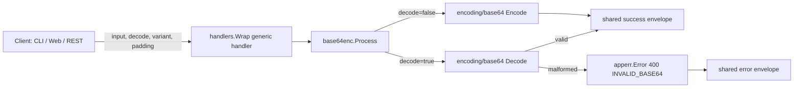

<!-- TOC -->

- [Base64 Encode/Decode — REST API](#base64-encodedecode--rest-api)
  - [Request](#request)
  - [Success response (200)](#success-response-200)
  - [Error response (400)](#error-response-400)

<!-- TOC -->

# Base64 Encode/Decode — REST API

`POST /api/v1/tools/base64`

## Request

```json
{ "input": "hello world", "options": { "decode": false, "variant": "standard", "padding": true } }
```

`options.variant`: `standard` (default) or `url`. `options.padding`: default `true`.

## Success response (200)

```json
{
  "success": true,
  "data": { "output": "aGVsbG8gd29ybGQ=" },
  "meta": { "tool": "base64", "duration_ms": 0.01 }
}
```

## Error response (400)

```json
{ "success": false, "error": { "code": "INVALID_BASE64", "message": "illegal base64 data at input byte 4" } }
```

## Workflow


