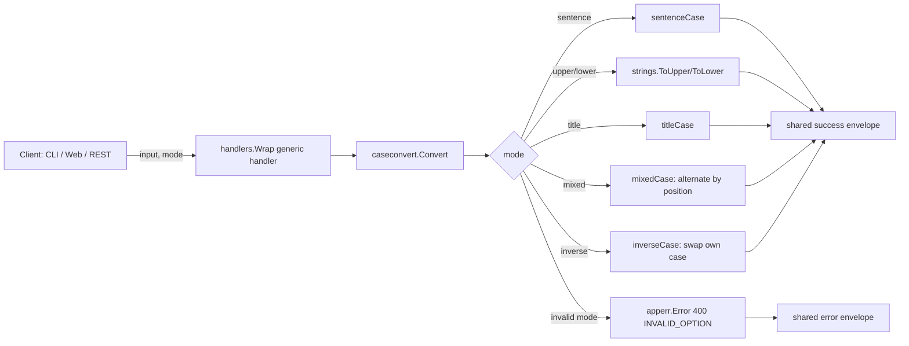

<!-- TOC -->

- [Case Converter — REST API](#case-converter--rest-api)
  - [Request](#request)
  - [Success response (200)](#success-response-200)
  - [Error response (400)](#error-response-400)

<!-- TOC -->

# Case Converter — REST API

`POST /api/v1/tools/case-convert`

## Request

```json
{ "input": "hello world. this IS a test!", "options": { "mode": "sentence" } }
```

`options.mode`: `sentence`, `upper`, `lower`, `title`, `mixed`, `inverse`.

## Success response (200)

```json
{
  "success": true,
  "data": { "output": "Hello world. This is a test!" },
  "meta": { "tool": "case-convert", "duration_ms": 0.03 }
}
```

## Error response (400)

```json
{ "success": false, "error": { "code": "INVALID_OPTION", "message": "mode must be one of [sentence upper lower title mixed inverse], got bogus" } }
```

## Workflow


