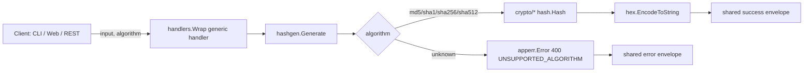

<!-- TOC -->

- [Hash Generator — REST API](#hash-generator--rest-api)
  - [Request](#request)
  - [Success response (200)](#success-response-200)
  - [Error response (400)](#error-response-400)

<!-- TOC -->

# Hash Generator — REST API

`POST /api/v1/tools/hash-gen`

## Request

```json
{ "input": "hello", "options": { "algorithm": "sha256" } }
```

`options.algorithm`: `md5`, `sha1`, `sha256` (default), `sha512`.

## Success response (200)

```json
{
  "success": true,
  "data": { "output": "2cf24dba5fb0a30e26e83b2ac5b9e29e1b161e5c1fa7425e73043362938b9824" },
  "meta": { "tool": "hash-gen", "duration_ms": 0.03 }
}
```

## Error response (400)

```json
{ "success": false, "error": { "code": "UNSUPPORTED_ALGORITHM", "message": "algorithm must be one of: md5, sha1, sha256, sha512" } }
```

## Workflow


