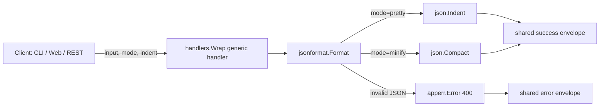

<!-- TOC -->

- [JSON Formatter — REST API](#json-formatter--rest-api)
  - [Request](#request)
  - [Success response (200)](#success-response-200)
  - [Error response (400)](#error-response-400)
  - [Workflow](#workflow)

<!-- TOC -->


# JSON Formatter — REST API

`POST /api/v1/tools/json-format`

## Request

```json
{ "input": "{\"a\":1}", "options": { "mode": "pretty", "indent": 2 } }
```

`options.mode`: `pretty` (default) or `minify`. `options.indent`: spaces per level, pretty mode only, default 2.

## Success response (200)

```json
{
  "success": true,
  "data": { "output": "{\n  \"a\": 1\n}" },
  "meta": { "tool": "json-format", "duration_ms": 0.07 }
}
```

## Error response (400)

Request:

```json
{ "input": "{\"a\":1,}" }
```

Response:

```json
{ "success": false, "error": { "code": "INVALID_JSON", "message": "invalid character '}' looking for beginning of object key string" } }
```

Error codes: `EMPTY_INPUT`, `INVALID_JSON`, `INVALID_OPTION` (bad `mode`).

**Note:** this endpoint is used by the CLI and by scripted REST clients. The web page's Validate/Beautify/Minify buttons run entirely in the browser via native `JSON.parse()`/`JSON.stringify()` instead of calling this endpoint, so that error messages exactly match real browser/Node.js `JSON.parse()` behavior (e.g. `Unexpected token } in JSON at position 45`) rather than Go's `encoding/json` wording. See `docs/testing/json-format.md` for how the web page is verified.

## Workflow


