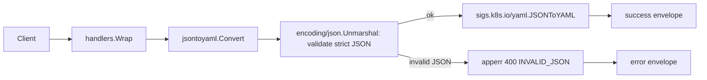

<!-- TOC -->

- [JSON to YAML Converter — REST API](#json-to-yaml-converter--rest-api)
  - [Request](#request)
  - [Success response (200)](#success-response-200)
  - [Error response (400)](#error-response-400)
  - [Workflow](#workflow)

<!-- TOC -->

# JSON to YAML Converter — REST API

`POST /api/v1/tools/json-to-yaml`

## Request

```json
{ "input": "{\"a\":1,\"b\":[\"x\",\"y\"]}" }
```

No options.

## Success response (200)

```json
{
  "success": true,
  "data": { "output": "a: 1\nb:\n- x\n- \"y\"\n" },
  "meta": { "tool": "json-to-yaml", "duration_ms": 0.07 }
}
```

Note `"y"` stays quoted in the YAML output (`- "y"`, not bare `- y`). This is deliberate: an unquoted `y` in YAML resolves as the boolean `true` under the YAML 1.1 core schema (see `docs/api/yaml-to-json.md`), so `sigs.k8s.io/yaml` quotes any string that would otherwise be misread as a different type.

## Error response (400)

Request:

```json
{ "input": "{\"a\":1,}" }
```

Response:

```json
{ "success": false, "error": { "code": "INVALID_JSON", "message": "invalid character '}' looking for beginning of object key string" } }
```

Unquoted keys and single-quoted strings are also rejected, even though the underlying YAML-based converter would otherwise silently accept them as YAML syntax — input is validated as strict JSON first (see `.skills/json-to-yaml/SKILL.md`).

Error codes: `EMPTY_INPUT`, `INVALID_JSON`.

## Workflow


