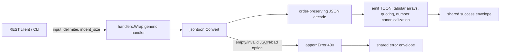
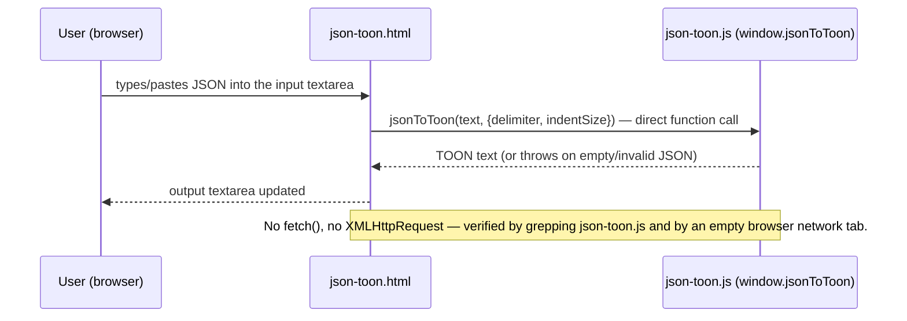

<!-- TOC -->

- [JSON to TOON Converter — REST API](#json-to-toon-converter--rest-api)
  - [Request](#request)
  - [Success response (200)](#success-response-200)
  - [Error response (400)](#error-response-400)
  - [Important: the web page does not use this endpoint](#important-the-web-page-does-not-use-this-endpoint)
  - [Workflow](#workflow)

<!-- TOC -->

# JSON to TOON Converter — REST API

`POST /api/v1/tools/json-toon`

Converts JSON into [TOON](https://github.com/toon-format/spec) (Token-Oriented Object Notation), a compact format designed to reduce LLM token usage.

## Request

```json
{ "input": "{\"id\":123,\"name\":\"Ada\",\"active\":true}", "options": { "delimiter": "comma", "indent_size": 2 } }
```

`options.delimiter`: `comma` (default), `tab`, or `pipe`. `options.indent_size`: spaces per indent level, default 2.

## Success response (200)

```json
{
  "success": true,
  "data": { "output": "id: 123\nname: Ada\nactive: true\n" },
  "meta": { "tool": "json-toon", "duration_ms": 0.06 }
}
```

Tabular array example — request `{"input":"{\"users\":[{\"id\":1,\"name\":\"Alice\",\"role\":\"admin\"},{\"id\":2,\"name\":\"Bob\",\"role\":\"user\"}]}"}` produces:

```json
{ "success": true, "data": { "output": "users[2]{id,name,role}:\n  1,Alice,admin\n  2,Bob,user\n" }, "meta": { "tool": "json-toon", "duration_ms": 0.05 } }
```

## Error response (400)

```json
{ "success": false, "error": { "code": "INVALID_JSON", "message": "unexpected end of JSON input" } }
```

Error codes: `EMPTY_INPUT`, `INVALID_JSON`, `INVALID_OPTION` (bad `delimiter`).

## Important: the web page does not use this endpoint

Every other tool's web page calls this REST endpoint via `fetch()`. **JSON to TOON Converter's web page does not** — it runs an independent JavaScript implementation of the same TOON rules (`internal/web/static/js/json-toon.js`) entirely in the browser, so no JSON ever leaves the visitor's machine for the interactive tool. Open your browser's network tab while using the web page to confirm no request is made to this endpoint.

This is also why `mytoolkit_tool_usage_total{tool="json-toon"}` (see `PLAN_ARCHITECTURE.md`'s Metrics design) only reflects direct API/CLI callers — web page conversions are invisible to server-side metrics, the same way CLI invocations already are for every tool.

## Workflow

REST / CLI path (Go implementation):



Web page path (JavaScript, no server involved):


