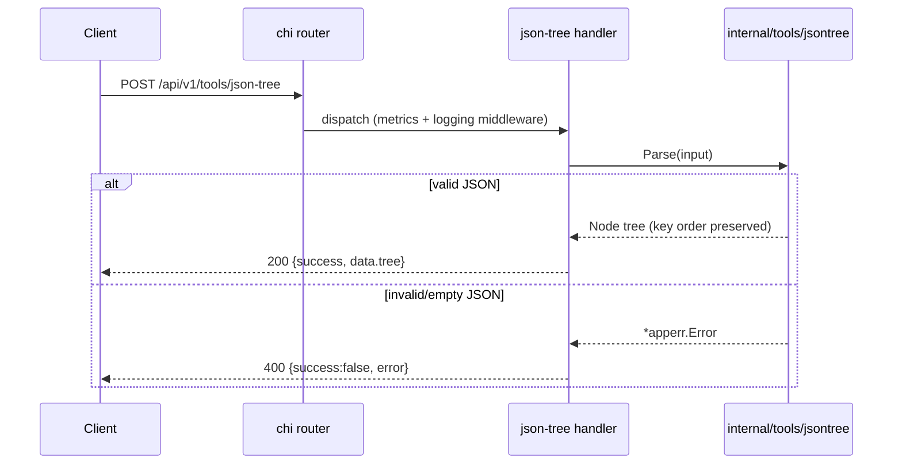

<!-- TOC -->

- [JSON Tree Viewer — REST API](#json-tree-viewer--rest-api)
  - [Request](#request)
  - [Success response (200)](#success-response-200)
  - [Error response (400)](#error-response-400)
  - [Workflow](#workflow)

<!-- TOC -->

# JSON Tree Viewer — REST API

`POST /api/v1/tools/json-tree`

Parses raw JSON into a navigable tree structure, preserving object key order.

## Request

```json
{ "input": "{\"a\":1,\"b\":[true,null]}" }
```

## Success response (200)

```json
{
  "success": true,
  "data": {
    "tree": {
      "type": "object",
      "children": [
        { "key": "a", "type": "number", "value": "1" },
        { "key": "b", "type": "array", "children": [
          { "type": "bool", "value": true },
          { "type": "null" }
        ]}
      ]
    }
  },
  "meta": { "tool": "json-tree", "duration_ms": 0.08 }
}
```

## Error response (400)

```json
{ "success": false, "error": { "code": "INVALID_JSON", "message": "invalid character '}' looking for beginning of object key string" } }
```

Error codes: `EMPTY_INPUT`, `INVALID_JSON`.

## Workflow


