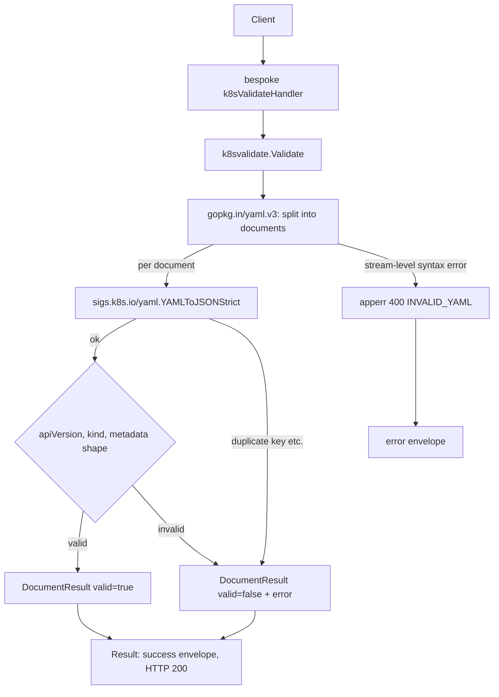

<!-- TOC -->

- [Kubernetes YAML Validator — REST API](#kubernetes-yaml-validator--rest-api)
  - [Request](#request)
  - [Success response (200)](#success-response-200)
  - [Error response (400)](#error-response-400)
  - [Workflow](#workflow)

<!-- TOC -->

# Kubernetes YAML Validator — REST API

`POST /api/v1/tools/k8s-validate`

## Request

```json
{ "input": "apiVersion: v1\nkind: ConfigMap\nmetadata:\n  name: cm1\ndata:\n  a: b\n" }
```

No options. The input may be a single YAML document or a `---`-separated multi-document stream, as accepted by `kubectl apply -f`.

## Success response (200)

`success: true` means the validator ran — it does **not** mean the YAML is valid. Overall and per-document validity live in `data.valid`/`data.documents[].valid`, the same way a linter's process exit code and its findings are two different things.

```json
{
  "success": true,
  "data": {
    "valid": true,
    "documents": [
      { "index": 1, "api_version": "v1", "kind": "ConfigMap", "name": "cm1", "valid": true }
    ]
  },
  "meta": { "tool": "k8s-validate", "duration_ms": 0.15 }
}
```

A document-level problem still returns HTTP 200 with `data.valid: false`:

Request:
```json
{ "input": "apiVersion: v1\nkind: ConfigMap\nmetadata:\n  name: cm1\n---\napiVersion: apps/v1\nmetadata:\n  name: dep1\n" }
```

Response:
```json
{
  "success": true,
  "data": {
    "valid": false,
    "documents": [
      { "index": 1, "api_version": "v1", "kind": "ConfigMap", "name": "cm1", "valid": true },
      { "index": 2, "api_version": "apps/v1", "valid": false, "error": "missing required field \"kind\"" }
    ]
  },
  "meta": { "tool": "k8s-validate", "duration_ms": 0.2 }
}
```

## Error response (400)

Only a hard YAML *syntax* error (the input can't be parsed at all) returns HTTP 400 — a document that parses fine but is missing `kind` is a 200 with `valid: false`, not a 400 (see above).

Request:
```json
{ "input": "apiVersion: [1, 2\n" }
```

Response:
```json
{ "success": false, "error": { "code": "INVALID_YAML", "message": "yaml: line 1: did not find expected ',' or ']'" } }
```

Error codes: `EMPTY_INPUT`, `NO_DOCUMENTS` (the input parses but contains no real documents — e.g. only `---` separators), `INVALID_YAML`.

**What this does *not* check**: this validates the two universal fields every Kubernetes API object needs (`apiVersion`, `kind`) plus `metadata`'s shape — not any specific resource's full schema. A `Deployment` with `spec.replicas: "three"` (a string instead of an integer) will report `valid: true` here; only `kubectl apply --dry-run=server` (against a real cluster) or a dedicated schema validator like `kubeconform` catches that. See `.skills/k8s-validate/SKILL.md` for why.

## Workflow


