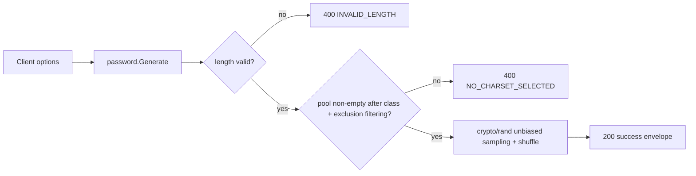

<!-- TOC -->

- [Password Generator — REST API](#password-generator--rest-api)
  - [Request](#request)
  - [Success response (200)](#success-response-200)
  - [Error response (400)](#error-response-400)
  - [Workflow](#workflow)

<!-- TOC -->

# Password Generator — REST API

`POST /api/v1/tools/password-gen`

This endpoint has no `input` field (nothing to transform) — only `options`.

## Request

```json
{
  "options": {
    "length": 20,
    "lowercase": true,
    "uppercase": true,
    "numbers": true,
    "symbols": true,
    "exclude_confusing": false,
    "exclude_ambiguous": true
  }
}
```

## Success response (200)

```json
{
  "success": true,
  "data": { "output": "Ne6mU6OVaiKq" },
  "meta": { "tool": "password-gen", "duration_ms": 0.1 }
}
```

## Error response (400)

```json
{ "success": false, "error": { "code": "NO_CHARSET_SELECTED", "message": "at least one character class must be enabled and non-empty after exclusions" } }
```

Error codes: `INVALID_LENGTH` (length `< 1` or `> 512`), `NO_CHARSET_SELECTED`.

## Workflow


