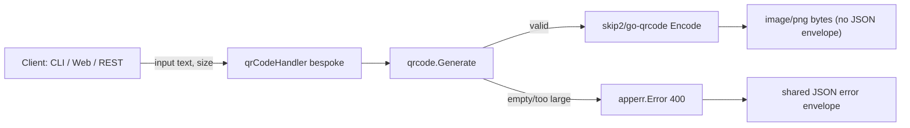

<!-- TOC -->

- [QR Code Generator — REST API](#qr-code-generator--rest-api)
  - [Request](#request)
  - [Success response (200)](#success-response-200)
  - [Error response (400, still JSON)](#error-response-400-still-json)

<!-- TOC -->

# QR Code Generator — REST API

`POST /api/v1/tools/qrcode`

## Request

```json
{ "input": "https://example.com", "options": { "size": 256 } }
```

## Success response (200)

Returns raw `image/png` bytes directly — **not** the shared JSON envelope. `Content-Type: image/png`, `Content-Disposition: inline; filename="qrcode.png"`. This is the one deliberate deviation from the envelope, since a JSON-wrapped base64 payload would prevent direct `` embedding and complicate downloading.

## Error response (400, still JSON)

```json
{ "success": false, "error": { "code": "EMPTY_INPUT", "message": "text must not be empty" } }
```

Error codes: `EMPTY_INPUT`, `INPUT_TOO_LARGE` (over ~2900 bytes), `QR_ENCODE_FAILED`.

## Workflow


