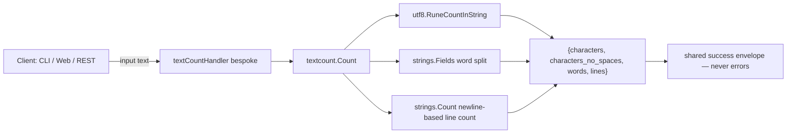

<!-- TOC -->

- [Character, Word \& Line Counter — REST API](#character-word--line-counter--rest-api)
  - [Request](#request)
  - [Success response (200)](#success-response-200)

<!-- TOC -->

# Character, Word & Line Counter — REST API

`POST /api/v1/tools/text-count`

## Request

```json
{ "input": "Hello world\nSecond line\n" }
```

## Success response (200)

```json
{
  "success": true,
  "data": { "characters": 24, "characters_no_spaces": 20, "words": 4, "lines": 2 },
  "meta": { "tool": "text-count", "duration_ms": 0.01 }
}
```

Never errors on empty/whitespace-only input — counting is well-defined for any text. `characters` counts unicode runes, not bytes.

## Workflow


