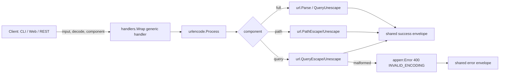

<!-- TOC -->

- [URL Encode/Decode — REST API](#url-encodedecode--rest-api)
  - [Request](#request)
  - [Success response (200)](#success-response-200)
  - [Error response (400)](#error-response-400)

<!-- TOC -->

# URL Encode/Decode — REST API

`POST /api/v1/tools/url-encode`

## Request

```json
{ "input": "hello world & friends", "options": { "decode": false, "component": "query" } }
```

`options.decode`: `false` (default, encode) or `true` (decode). `options.component`: `query` (default), `path`, or `full`.

## Success response (200)

```json
{
  "success": true,
  "data": { "output": "hello+world+%26+friends" },
  "meta": { "tool": "url-encode", "duration_ms": 0.01 }
}
```

## Error response (400)

```json
{ "success": false, "error": { "code": "INVALID_ENCODING", "message": "invalid URL escape \"%ZZ\"" } }
```

## Workflow


