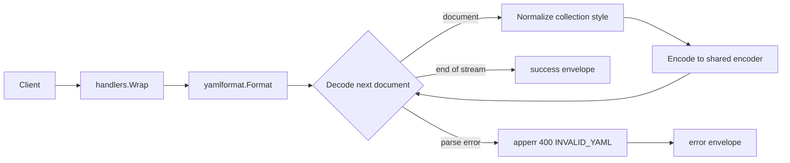

<!-- TOC -->

- [YAML Formatter — REST API](#yaml-formatter--rest-api)
  - [Request](#request)
  - [Success response (200)](#success-response-200)
  - [Error response (400)](#error-response-400)
  - [Workflow](#workflow)

<!-- TOC -->

# YAML Formatter — REST API

`POST /api/v1/tools/yaml-format`

## Request

```json
{ "input": "a: 1\nb:\n    - x\n    - y\n", "options": { "indent": 2, "style": "block" } }
```

`options.style`: `block` (default, indented) or `flow` (compact `{}`/`[]`, single line). `options.indent`: spaces per level, block style only, default 2.

## Success response (200)

```json
{
  "success": true,
  "data": { "output": "a: 1\nb:\n  - x\n  - y\n" },
  "meta": { "tool": "yaml-format", "duration_ms": 0.11 }
}
```

Multi-document streams (`---`-separated) are fully processed — every document is reformatted and rejoined with `---`. Request `{ "input": "a: 1\n---\nb: 2\n" }` returns `{ "output": "a: 1\n---\nb: 2\n" }`.

`style: flow` collapses collections to one line. Request `{ "input": "a:\n  b: 1\n  c:\n    - 1\n    - 2\n", "options": { "style": "flow" } }` returns `{ "output": "{a: {b: 1, c: [1, 2]}}\n" }`.

## Error response (400)

Request:

```json
{ "input": "a: 1\n  b: 2\n" }
```

Response:

```json
{ "success": false, "error": { "code": "INVALID_YAML", "message": "yaml: line 2: mapping values are not allowed in this context" } }
```

Error codes: `EMPTY_INPUT`, `INVALID_YAML`, `INVALID_OPTION` (bad `style`).

## Workflow


