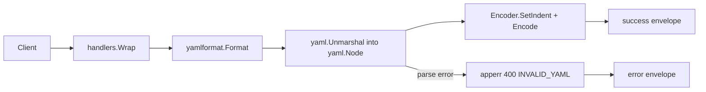

<!-- TOC -->

- [YAML Formatter — REST API](#yaml-formatter--rest-api)
  - [Request](#request)
  - [Success response (200)](#success-response-200)
  - [Error response (400)](#error-response-400)
  - [Workflow](#workflow)

<!-- TOC -->

# YAML Formatter — REST API

`POST /api/v1/tools/yaml-format`

## Request

```json
{ "input": "a: 1\nb:\n    - x\n    - y\n", "options": { "indent": 2 } }
```

## Success response (200)

```json
{
  "success": true,
  "data": { "output": "a: 1\nb:\n  - x\n  - y\n" },
  "meta": { "tool": "yaml-format", "duration_ms": 0.08 }
}
```

## Error response (400)

Request:

```json
{ "input": "a: 1\n  b: 2\n" }
```

Response:

```json
{ "success": false, "error": { "code": "INVALID_YAML", "message": "yaml: line 2: mapping values are not allowed in this context" } }
```

Error codes: `EMPTY_INPUT`, `INVALID_YAML`. Only the first YAML document is processed if multiple `---`-separated documents are pasted.

## Workflow


