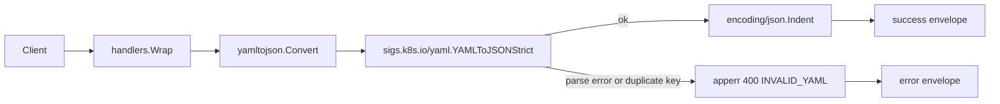

<!-- TOC -->

- [YAML to JSON Converter — REST API](#yaml-to-json-converter--rest-api)
  - [Request](#request)
  - [Success response (200)](#success-response-200)
  - [Error response (400)](#error-response-400)
  - [Workflow](#workflow)

<!-- TOC -->

# YAML to JSON Converter — REST API

`POST /api/v1/tools/yaml-to-json`

## Request

```json
{ "input": "a: 1\nb:\n  - x\n  - y\n", "options": { "indent": 2 } }
```

`options.indent`: spaces per level, default 2.

## Success response (200)

```json
{
  "success": true,
  "data": { "output": "{\n  \"a\": 1,\n  \"b\": [\n    \"x\",\n    true\n  ]\n}" },
  "meta": { "tool": "yaml-to-json", "duration_ms": 0.1 }
}
```

Note `"y"` converting to JSON `true`, not the string `"y"`. This is not a bug: `sigs.k8s.io/yaml` resolves unquoted `y`/`n`/`yes`/`no`/`on`/`off` per the YAML 1.1 core schema (the same rule that makes `country: NO` resolve to `false` — the well-known "Norway problem"). Quote such values in the source YAML (`"y"`) if you want them to survive as strings.

## Error response (400)

Request:

```json
{ "input": "a: [1, 2\n" }
```

Response:

```json
{ "success": false, "error": { "code": "INVALID_YAML", "message": "yaml: line 1: did not find expected ',' or ']'" } }
```

Duplicate mapping keys are also rejected (the YAML spec forbids them):

Request:

```json
{ "input": "a: 1\na: 2\n" }
```

Response:

```json
{ "success": false, "error": { "code": "INVALID_YAML", "message": "yaml: unmarshal errors:\n  line 2: key \"a\" already set in map" } }
```

Error codes: `EMPTY_INPUT`, `INVALID_YAML`. Only the first document in a multi-document (`---`-separated) YAML stream is converted.

## Workflow


