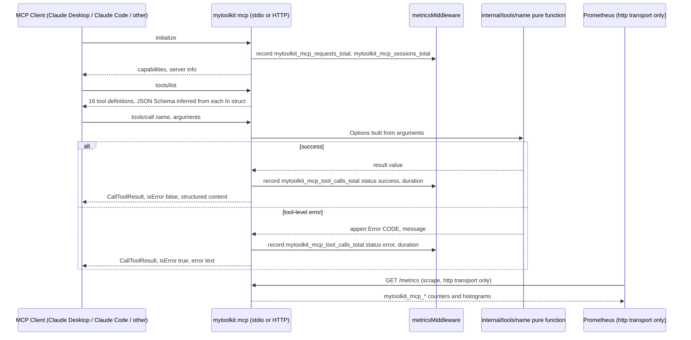
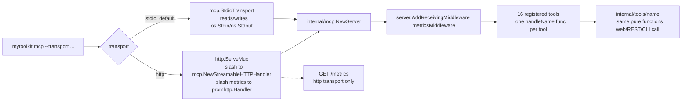

<!-- TOC -->

- [MyToolkit MCP Server](#mytoolkit-mcp-server)
  - [Overview](#overview)
  - [Installation](#installation)
  - [Available tools](#available-tools)
  - [Configuration](#configuration)
  - [Usage with an MCP client](#usage-with-an-mcp-client)
  - [Examples](#examples)
  - [Observability](#observability)
  - [Workflow](#workflow)
  - [Debugging](#debugging)

<!-- TOC -->

# MyToolkit MCP Server

An [MCP](https://modelcontextprotocol.io) (Model Context Protocol) server that exposes every [MyToolkit](../README.md) tool to MCP-aware clients (Claude Desktop, Claude Code, Cursor, and any other MCP client), so an LLM assistant can format JSON, validate Kubernetes manifests, generate passwords, decode JWTs, and so on, as part of a conversation.

## Overview

The MCP server is not a separate service with its own logic — it's a 4th surface on the same `mytoolkit` binary, alongside the web UI, the REST API, and the CLI (see the repository root [CLAUDE.md](../CLAUDE.md)). It calls the exact same `internal/tools/<name>` Go functions the other three surfaces call, via `mytoolkit mcp`. There is nothing to install separately: any build of `mytoolkit` already contains the MCP server as a subcommand.

The Go source lives at `app/internal/mcp/` (importable only from inside the `app/` module tree, per Go's `internal/` package rule) and `app/internal/cli/mcp.go` (the `mcp` subcommand). This `mcp/` folder at the repository root holds only documentation and MCP client configuration examples — the same role `docs/` and `helm/` already play for non-Go material, kept apart from `app/`'s Go source per the repository layout convention.

## Installation

Build from source (from the repository root):

```
make build
./bin/mytoolkit mcp --help
```

Or with Docker (the same image used for `serve`; see the root [Dockerfile](../Dockerfile)):

```
docker build -t mytoolkit:latest .
docker run --rm -i mytoolkit:latest mcp
```

`-i` (interactive) is required for the stdio transport: MCP clients pipe JSON-RPC over the container's stdin/stdout, so the container must not be detached.

## Available tools

The MCP server registers **16 tools** (MyToolkit's 15 tools, plus JWT split into two: `jwt_encode`/`jwt_decode`, since a clean, independently-documented input shape per operation is a better fit for how MCP clients pick a tool than replicating the REST endpoint's single `mode` field). MCP tool names use underscores where the REST/CLI slug uses a hyphen only for `jwt_encode`/`jwt_decode` — every other tool keeps its familiar hyphenated slug as the MCP tool name.

| MCP tool | Maps to | Description |
|---|---|---|
| `base64` | [Base64 Encode/Decode](../docs/api/base64.md) | Encode or decode text using Base64 (standard or URL-safe variant, with optional padding). |
| `case-convert` | [Case Converter](../docs/api/case-convert.md) | Convert text between Sentence case, UPPER CASE, lower case, Title Case, mIxEd cAsE, and InVeRsE cAsE. |
| `hash-gen` | [Hash Generator](../docs/api/hash-gen.md) | Generate a hex-encoded hash (MD5, SHA-1, SHA-256, or SHA-512) of text. |
| `json-format` | [JSON Formatter](../docs/api/json-format.md) | Format (pretty-print) or minify a JSON document. |
| `json-to-yaml` | [JSON to YAML Converter](../docs/api/json-to-yaml.md) | Convert a JSON document to YAML. |
| `json-toon` | [JSON to TOON Converter](../docs/api/json-toon.md) | Convert JSON into TOON to shrink LLM token usage. |
| `json-tree` | [JSON Tree Viewer](../docs/api/json-tree.md) | Parse JSON into a tree structure (key, type, value, children). |
| `jwt_decode` | [JWT Encode/Decode](../docs/api/jwt.md) | Decode a JWT's header and claims, optionally verifying its signature. |
| `jwt_encode` | [JWT Encode/Decode](../docs/api/jwt.md) | Sign a JSON claims object into a JWT. |
| `k8s-validate` | [Kubernetes YAML Validator](../docs/api/k8s-validate.md) | Validate that a YAML document has the fields the Kubernetes API requires. |
| `password-gen` | [Password Generator](../docs/api/password-gen.md) | Generate a cryptographically random password. |
| `qrcode` | [QR Code Generator](../docs/api/qrcode.md) | Generate a QR code PNG image from text or a URL. |
| `text-count` | [Character, Word & Line Counter](../docs/api/text-count.md) | Count characters, words, and lines in text. |
| `url-encode` | [URL Encode/Decode](../docs/api/url-encode.md) | Encode or decode text according to URL encoding rules. |
| `yaml-format` | [YAML Formatter](../docs/api/yaml-format.md) | Format a YAML document with consistent indentation. |
| `yaml-to-json` | [YAML to JSON Converter](../docs/api/yaml-to-json.md) | Convert a YAML document to pretty-printed JSON. |

Each tool's full input schema (every field, its type, and its default) is discoverable at runtime via the standard MCP `tools/list` request — every MCP client surfaces this automatically, so it isn't duplicated field-by-field here. The linked `docs/api/<slug>.md` page documents the same options for the REST surface, which the MCP `In` struct mirrors field-for-field (see `app/internal/mcp/<name>.go`).

Two behaviors worth calling out because they differ from a naive read of the tool name:
- **`qrcode`** returns an MCP image content block (`image/png`, base64-encoded on the wire), not text — the one binary-output exception, matching the REST endpoint's own `image/png` exception.
- **`k8s-validate`**: a YAML document that parses fine but is semantically invalid for Kubernetes (missing `apiVersion`, for example) is **not** an MCP tool error — the call succeeds and the structured result reports `"valid": false` for that document. Only a hard YAML syntax error is a tool error.

## Configuration

Same `CLI flag > environment variable > built-in default` precedence as the rest of MyToolkit (see [docs/environment-variables.md](../docs/environment-variables.md)):

| Variable | CLI flag (`mcp`) | Default | Description |
|---|---|---|---|
| `MYTOOLKIT_MCP_TRANSPORT` | `--transport` | `stdio` | `stdio` or `http`. |
| `MYTOOLKIT_MCP_PORT` | `--port` | `8081` | TCP port to listen on (`http` transport only). |
| `MYTOOLKIT_HOST` | `--host` | `0.0.0.0` | Interface to bind to (`http` transport only) — shared with `serve`. |
| `MYTOOLKIT_LOG_LEVEL` | `--log-level` | `info` | zerolog level: `debug`, `info`, `warn`, `error` — shared with `serve`. |

Logs always go to stderr — for the `stdio` transport this is a correctness requirement, not just convention: stdout must carry nothing but the JSON-RPC protocol stream, or MCP clients will fail to parse it.

## Usage with an MCP client

New to MCP? Every client needs to know how to *start* (or connect to) `mytoolkit mcp`, and there are always two ways to tell it that:

- **Client command** — some clients (Claude Code) ship a CLI subcommand that writes the config file for you. Fastest, least error-prone; use it if your client has one.
- **Manual config file edit** — every MCP client reads its server list from a JSON file. Editing it yourself works everywhere, including clients with no add command (Claude Desktop, Cursor), and is the only option once you need something the command doesn't expose.

Both paths produce the same result: the client starts (or connects to) `mytoolkit mcp` and sees the 16 tools.

Before either path, build the binary once and note its **absolute path** — config files don't reliably resolve `~` or a bare `mytoolkit`, unless it's already on the client's `PATH`:

```
make build
readlink -f ./bin/mytoolkit   # copy this path, you'll paste it below
```

### stdio (local, the common case)

Most MCP clients run the server as a child process and speak JSON-RPC over its stdin/stdout — nothing needs to be listening on a port.

**Claude Code** (has an add command)

- Using the command (recommended):
  ```
  claude mcp add mytoolkit -- /absolute/path/to/mytoolkit mcp
  ```
- Manual config: copy [`examples/claude_code_mcp.json`](examples/claude_code_mcp.json) into your project root as `.mcp.json` (merge it in if one already exists), swapping in the absolute path if `mytoolkit` isn't on your `PATH`.
- Verify it connected: run `/mcp` inside Claude Code — it should list `mytoolkit` as connected.

**Claude Desktop** (no add command — config file only)

1. Open Settings → Developer → Edit Config.
2. Merge [`examples/claude_desktop_config.json`](examples/claude_desktop_config.json) into `claude_desktop_config.json`, replacing `/absolute/path/to/mytoolkit` with your real path.
3. Restart Claude Desktop — it only reads this file on startup.

**Cursor** (no add command — config file only)

Cursor reads the same `mcpServers` shape, either project-scoped (`.cursor/mcp.json`) or global (`~/.cursor/mcp.json`, applies to every project).

1. Open Cursor Settings → MCP → "Add new MCP server" (this just opens the JSON file for you to edit — there's no separate wizard).
2. Merge [`examples/cursor_mcp.json`](examples/cursor_mcp.json) in, again with the absolute path.
3. Reload the Cursor window (Command Palette → "Reload Window") so it picks up the change.

Every example file above points at `mytoolkit mcp` with no extra flags, since `stdio` is already the default transport.

**If a client shows 0 tools or "disconnected"**: the two most common beginner mistakes are (1) a relative path or bare `mytoolkit` that isn't resolvable from wherever the client's child process runs, and (2) invalid JSON after a manual merge (missing comma, unbalanced braces) — validate with `python3 -m json.tool < path/to/config.json` before restarting the client.

### Streamable HTTP (remote / shared server)

Start the server listening on a port:

```
mytoolkit mcp --transport http --port 8081
```

or, via Docker Compose, with the optional `mcp` profile (see the root [docker-compose.yml](../docker-compose.yml)):

```
docker compose --profile mcp up -d mytoolkit-mcp
```

or in Kubernetes, by enabling the Helm chart's optional MCP Deployment/Service (see [helm/mytoolkit/values.yaml](../helm/mytoolkit/values.yaml)'s `mcp.enabled`).

Then point a client at it:

```
claude mcp add --transport http mytoolkit http://localhost:8081/
```

or see [`examples/claude_desktop_config_http.json`](examples/claude_desktop_config_http.json) for the Claude Desktop equivalent, or [`examples/cursor_mcp_http.json`](examples/cursor_mcp_http.json) for Cursor — merge the latter into `.cursor/mcp.json` (or `~/.cursor/mcp.json`) and reload the window, same manual-edit flow as the stdio case above, just with a `url` instead of a `command`.

## Examples

Captured from a real `mytoolkit mcp` (stdio) process, driven by a small MCP client, against the actual built binary — not hand-typed.

`tools/list` (16 tools, one line each — abbreviated here to two):

```
- base64: Encode or decode text using Base64 (standard or URL-safe variant, with optional padding).
- jwt_decode: Decode a JWT's header and claims, optionally verifying its signature with a secret (HMAC) or public key (RSA/ECDSA/EdDSA).
```

`tools/call base64` (`{"input": "hello mytoolkit mcp"}`):

```json
{
  "output": "aGVsbG8gbXl0b29sa2l0IG1jcA=="
}
```

`tools/call k8s-validate` (`{"input": "kind: Pod\nmetadata:\n  name: x\n"}`) — a parseable-but-invalid document, `isError=false`:

```json
{
  "documents": [
    {
      "error": "missing required field \"apiVersion\"",
      "index": 1,
      "valid": false
    }
  ],
  "valid": false
}
```

`tools/call base64` with an invalid option (`{"input": "hi", "variant": "bogus"}`) — `isError=true`:

```
INVALID_OPTION: variant must be one of [standard url], got bogus
```

`tools/call qrcode` (`{"text": "https://github.com/aeciopires/mytoolkit"}`) returns one `image/png` content block (486 raw bytes in this run) rather than JSON text.

A minimal `curl` handshake against the HTTP transport (`mytoolkit mcp --transport http --port 8091`):

```
$ curl -s -i http://localhost:8091/ \
    -H "Content-Type: application/json" \
    -H "Accept: application/json, text/event-stream" \
    -d '{"jsonrpc":"2.0","id":1,"method":"initialize","params":{"protocolVersion":"2025-06-18","capabilities":{},"clientInfo":{"name":"curl-test","version":"0.0.1"}}}'

HTTP/1.1 200 OK
Content-Type: text/event-stream
Mcp-Session-Id: QGSTBHIEWRBB2HCBIVSTGW65XC

event: message
data: {"jsonrpc":"2.0","id":1,"result":{"capabilities":{"logging":{},"tools":{"listChanged":true}},"protocolVersion":"2025-06-18","serverInfo":{"name":"mytoolkit","title":"MyToolkit","version":"1.0.0"}}}
```

## Observability

Every JSON-RPC method call (both transports) is recorded by `internal/mcp`'s `metricsMiddleware` (`server.AddReceivingMiddleware`, applied once, covering every tool without per-tool instrumentation) into Prometheus collectors distinct from the REST/web surface's `mytoolkit_http_*`/`mytoolkit_tool_usage_total` — see `PLAN_ARCHITECTURE.md`'s usage-ranking scope note for why they're kept separate:

| Metric | Type | Labels | What it measures |
|---|---|---|---|
| `mytoolkit_mcp_requests_total` | Counter | `method`, `status` | Every JSON-RPC method (`initialize`, `tools/list`, `tools/call`, `notifications/initialized`, ...). |
| `mytoolkit_mcp_request_duration_seconds` | Histogram | `method` | Duration of every JSON-RPC method call. |
| `mytoolkit_mcp_tool_calls_total` | Counter | `tool`, `status` | `tools/call` requests specifically, broken down by MCP tool name. `status` is `success` or `error` (a tool result with `isError: true` counts as `error`, matching what the MCP client actually sees — not just Go-level protocol errors). |
| `mytoolkit_mcp_tool_call_duration_seconds` | Histogram | `tool` | Duration of `tools/call` requests, per tool. |
| `mytoolkit_mcp_sessions_total` | Counter | — | Sessions established (successful `initialize` requests). |

**Only reachable when `--transport http`.** The `stdio` transport has no listening port — Prometheus's pull model has nothing to scrape from a local child process talking JSON-RPC over stdin/stdout, so metrics aren't exposed there (this is inherent to stdio, not a gap). When running `--transport http`, `/metrics` is served on the same port as the MCP endpoint itself (`internal/cli/mcp.go` mounts both on one `http.ServeMux`: `/` for JSON-RPC, `/metrics` for Prometheus), so no extra port or flag is needed.

Verified end-to-end against the real docker-compose stack (`docker compose --profile mcp up -d mytoolkit mytoolkit-mcp prometheus grafana`): driving real `tools/call` requests at the `mytoolkit-mcp` service and querying Prometheus directly returns exactly what was called —

```
$ curl -s 'http://localhost:9090/api/v1/query?query=mytoolkit_mcp_tool_calls_total' | python3 -m json.tool
...
{"metric": {"tool": "base64", "status": "error", ...}, "value": [..., "1"]},
{"metric": {"tool": "base64", "status": "success", ...}, "value": [..., "1"]},
{"metric": {"tool": "hash-gen", "status": "success", ...}, "value": [..., "1"]},
{"metric": {"tool": "json-format", "status": "success", ...}, "value": [..., "1"]}
```

**Wiring**: `observability/prometheus.yml`'s `mytoolkit-mcp` job scrapes the Compose service (`mytoolkit-mcp:8081`, only up when `--profile mcp` is running); `helm/mytoolkit/templates/mcp-deployment.yaml` carries the same `prometheus.io/scrape`/`port`/`path` pod annotations as the main Deployment, plus an optional `mcp-servicemonitor.yaml` (`mcp.enabled && metrics.serviceMonitor.enabled`) for Prometheus Operator setups. The Grafana dashboard (`observability/mytoolkit-dashboard.json`, provisioned automatically by `docker-compose.yml`) has a dedicated **"MCP Server"** row — tool call rate/errors/latency percentiles by tool, request rate by JSON-RPC method, session count, and a ranking table — verified rendering real data from this same stack via Grafana's own datasource-proxy API, not just "the JSON looks right."

## Workflow

Request lifecycle, either transport — the MCP server always calls straight into the same `internal/tools/<name>` pure function the web UI and REST API call:



Where each transport plugs in, and what the `mcp` subcommand builds on top of `internal/mcp.NewServer` (the same function called by both branches, since `internal/tools/<name>` functions are pure and cheap to wire up fresh):



## Debugging

The community [MCP Inspector](https://modelcontextprotocol.io/legacy/tools/inspector) (`npx @modelcontextprotocol/inspector`) can drive `mytoolkit mcp` interactively if you have Node.js available — point it at the built binary with `mcp` as the sole argument. It's an optional third-party tool, not a MyToolkit dependency, so it isn't wired into the Makefile.
